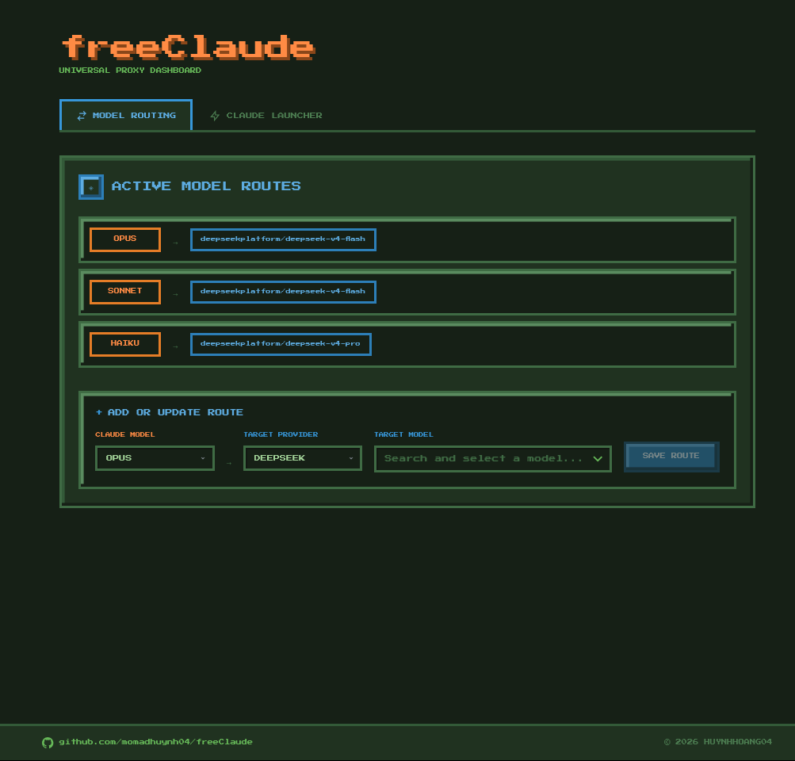
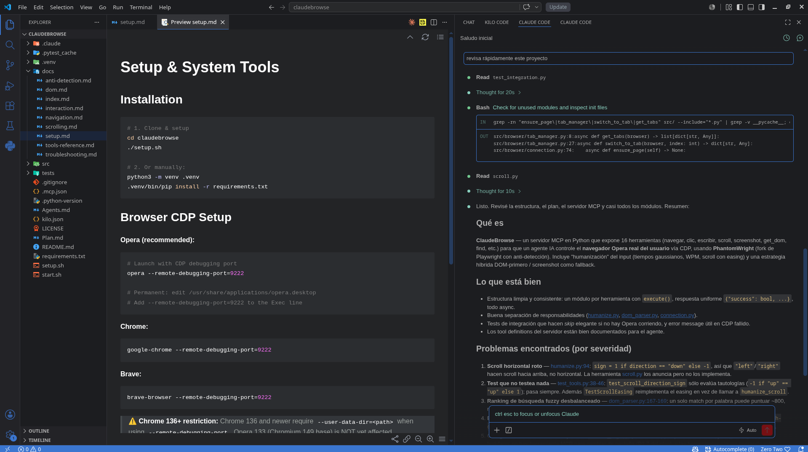
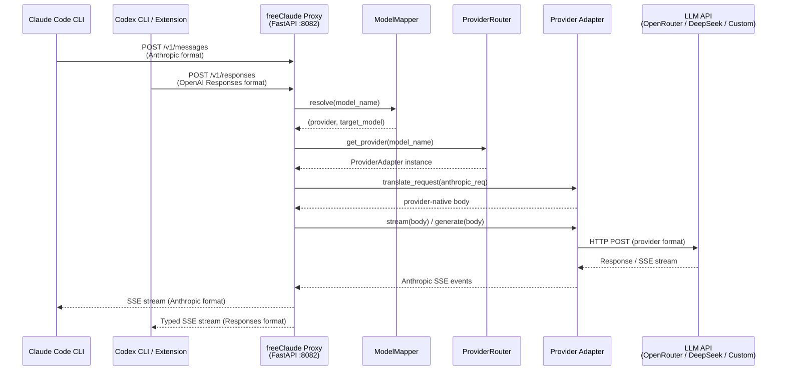
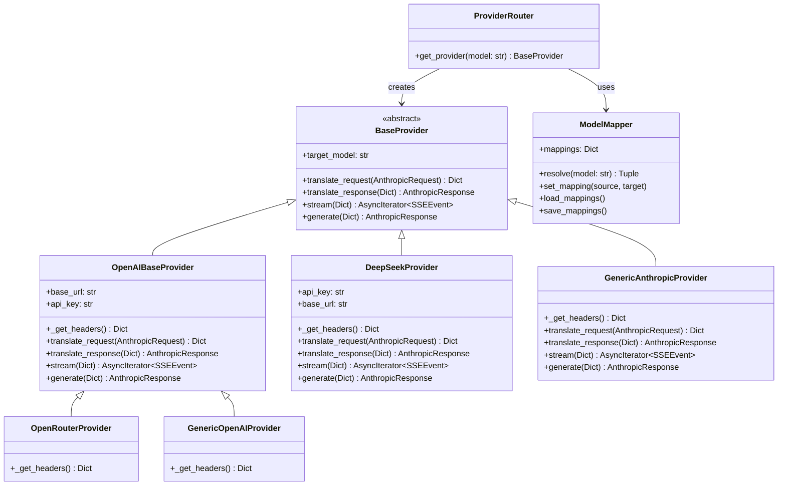
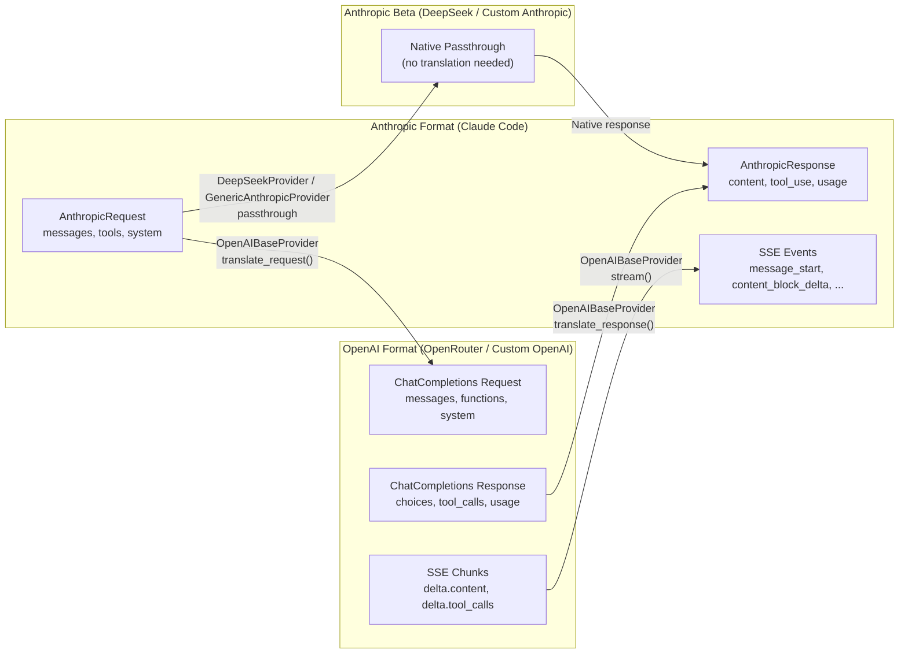

<div align="center">

  <h1>freeClaude</h1>
  <h3><strong>Unlock Claude Code — Free & Flexible</strong></h3>

  <p>
    
    
    
    
    
    
    
    
  </p>

  <p>An intelligent proxy server that re-routes Claude Code and Codex traffic to alternative LLM providers — OpenRouter, DeepSeek, or any custom OpenAI/Anthropic API — with full tool-call fidelity. Auto-detect installed IDEs, auto-configure settings, and launch with one click.</p>

  <p>
    <a href="#features">Features</a> •
    <a href="#quick-start">Quick Start</a> •
    <a href="#usage">Usage</a> •
    <a href="#configuration">Configuration</a> •
    <a href="#development">Development</a> •
    <a href="#architecture">Architecture</a>
  </p>

  <br/>

  
  <br/>
  <i>WebUI Dashboard — Model routing, IDE detection, one-click launch</i>
  <br/><br/>
  
  <br/>
  <i>Claude Code CLI running through freeClaude proxy with a DeepSeek backend</i>
</div>

---

## Features

| Feature | Description |
| ------- | ----------- |
| **Multi-Provider Routing** | Routes Anthropic and OpenAI traffic to OpenRouter, DeepSeek, or any OpenAI-compatible / Anthropic custom provider. |
| **Custom Providers** | Add any OpenAI-compatible or Anthropic API via **WebUI** (`+ ADD CUSTOM PROVIDER`) or **CLI** (`python -m cli add-provider`). API keys are referenced by ENV var name (e.g. `MY_PROVIDER_API_KEY`) — never stored raw. |
| **Claude Code + Codex** | Native ingresses: `POST /v1/messages` (Claude Code), `POST /v1/chat/completions` (legacy Codex), `POST /v1/responses` (Codex ≥0.149, including `additional_tools` / `namespace` / `custom:exec` unwrapping). |
| **Full SSE Streaming** | Real-time token-by-token streaming with Anthropic ↔ OpenAI SSE event translation, plus Codex typed `response.*` events and agentic retry. |
| **IDE Auto-Detect & Launch** | Detects VS Code, VSCodium, and Cursor. Auto-configures `~/.claude/settings.json` and `~/.codex/config.toml` (`wire_api = "responses"`) and IDE settings. One-click launch from WebUI. |
| **Terminal Launch** | Opens a new terminal with `ANTHROPIC_BASE_URL` / `OPENAI_BASE_URL` pre-set. Supports gnome-terminal, konsole, xterm, alacritty, kitty, etc. |
| **Native Tool Calls** | Bi-directional tool/function translation with `toolu_` ID handling and weak-model rescue (`functions.exec: {…}` → real tool call). |
| **Web UI Dashboard** | React + TailwindCSS dashboard for model routing, provider management, IDE detection, and one-click launching. |
| **Extensible** | `BaseProvider → OpenAIBaseProvider` inheritance. Custom providers are zero-code; code-based providers still ~20 lines. |
| **Cross-Platform** | Windows, Linux, and macOS. CI-tested on both Windows and Linux (GitHub Actions). |

---

## Quick Start

### Prerequisites

- **Python 3.11+** — `python --version`
- **Node.js 18+ & npm** — for the WebUI frontend
- **API Key** for at least one provider ([OpenRouter](https://openrouter.ai/keys), [DeepSeek](https://platform.deepseek.com/api_keys), or any custom provider)

> **IMPORTANT — If you plan to use the Claude Code extension in VS Code / VSCodium / Cursor:**
> You MUST first install the Claude Code CLI globally via your terminal. The VS Code extension bundles its own copy of the CLI, but it requires the native binary to be present on your system.
>
> ```bash
> npm install -g @anthropic-ai/claude-code
> ```
>
> Without the native CLI installed, the extension will fail to initialize even after auto-configuration. This is a hard requirement from Anthropic, not freeClaude.

### Installation

**1. Clone the repository**
```bash
git clone https://github.com/momadhuynh04/freeClaude.git
cd freeClaude
```

**2. Create and activate a Python virtual environment**
```bash
python -m venv venv

# Windows (Command Prompt / PowerShell)
venv\Scripts\activate

# Linux / macOS
source venv/bin/activate
```

**3. Install Python dependencies**
```bash
pip install -r requirements.txt
```

**4. Configure your API keys**

Copy the example config:
```bash
cp .env.example .env
```

Edit `.env` and add your API keys:
```env
OPENROUTER_API_KEY="sk-or-v1-..."
DEEPSEEK_API_KEY="sk-..."
# For custom providers, add one ENV var per provider (referenced by name in UI/CLI):
MY_PROVIDER_API_KEY="sk-..."
BEEKNOEE_API_KEY="sk-..."
```

**5. Build the WebUI**
```bash
cd webui
npm install
npm run build
cd ..
```

**6. Launch**

| Platform | Production | Development |
| -------- | ---------- | ----------- |
| Windows | `start.bat` | `dev.bat` |
| Linux / macOS | `./start.sh` | `./dev.sh` |

Or manually:
```bash
uvicorn proxy.server:app --host 127.0.0.1 --port 8082
# or via CLI
python -m cli serve
```

Then open `http://127.0.0.1:8082` in your browser.

---

## Usage

### 1. Route Models

In the **Model Routing** tab:
- Select a Claude model tier (Opus / Sonnet / Haiku) or `codex`
- Pick a provider (OpenRouter, DeepSeek, or any custom provider)
- Choose a target model from the live list
- Click **Save Route**

All mappings are persisted to `config.json` and editable live. You can also route custom providers directly, e.g. `beeknoee/stealth/ox-alpha`, via the `codex` slot or any tier.

### 2. Custom Providers

**Via WebUI** — In **Model Routing**, click **+ ADD CUSTOM PROVIDER** and fill in:

| Field | Description |
| ----- | ----------- |
| **Provider ID** | Slug (`myprovider`, `2-32` chars, lowercase) |
| **Display name** | Human-readable name |
| **Provider API** | `OpenAI Compatible` or `Anthropic` |
| **Base URL** | e.g. `https://api.myprovider.com/v1` |
| **API key** | **ENV var name** (e.g. `MY_PROVIDER_API_KEY`), not the raw key — put `MY_PROVIDER_API_KEY=sk-...` in `.env` |
| **Models** | List of `ID`, `Name`, `Reasoning` / `Image` flags |
| **Headers** | Optional extra headers (`Header-Name: value`) |

`GET /api/custom-providers` never returns the raw key; it reports `has_key` by checking both `os.environ` and `.env`.

**Via CLI**:
```bash
# Add a provider
export MY_PROVIDER_API_KEY=sk-...
python -m cli add-provider \
  --id myprovider \
  --display-name "My AI Provider" \
  --api openai_compatible \
  --base-url https://api.myprovider.com/v1 \
  --api-key-env MY_PROVIDER_API_KEY \
  --model model-a:"Model A":0:0 \
  --header X-Title=freeClaude

python -m cli list-providers
python -m cli remove-provider myprovider
python -m cli list-models myprovider

# Other CLI entry
python -m cli serve   # same as uvicorn launcher
```

Custom providers work for both Claude Code (`POST /v1/messages`) and Codex (`POST /v1/responses`): OpenAI-compatible ones go through `OpenAIBaseProvider` translation (handling both), Anthropic ones use a lightweight passthrough.

### 3. Launch Claude Code / Codex

In the **Launcher** tab, you can choose between:

| Launch Target | Description |
| ------------- | ----------- |
| **Terminal** | Opens a new terminal window with `ANTHROPIC_BASE_URL` and `ANTHROPIC_API_KEY` pre-configured. Supports local directories and git clone. |
| **Codex** | Writes `~/.codex/config.toml` (preserving your existing settings) and opens a new terminal running `codex` routed through the proxy. Works for both Codex CLI and the Codex VS Code extension. |
| **VS Code / VSCodium / Cursor** | Auto-detected from your system. One click: sets up `~/.claude/settings.json`, configures the IDE's `disableLoginPrompt`, and opens the IDE in your project folder. |

For IDE launches, the Claude Code extension picks up the proxy settings automatically from `~/.claude/settings.json` — no manual configuration needed.

> **Codex model routing:** requests like `gpt-5-codex` resolve through the keyword tiers
> (`gpt-5-codex` → `codex` → `gpt`). Add a mapping with source key `codex` in the Model
> Routing tab to control which backend Codex uses. The Codex CLI (>= 0.149) requires
> `wire_api = "responses"`; freeClaude implements the Responses API natively at `/v1/responses` and unwraps `additional_tools`/`namespace`/`custom:exec` so free-tier lite models can use tools.

> **IDE not showing up?** freeClaude detects IDEs by scanning your system `PATH`. If an IDE was installed but doesn't appear:
> 1. Check if the binary is in `PATH`:
>    - **Windows**: `where code` or `where cursor`
>    - **Linux / macOS**: `echo $PATH` — then `which code` or `which cursor`
> 2. If missing, add its directory to `PATH`:
>    - **Windows**: `setx PATH "%PATH%;C:\path\to\ide"` (or via System Properties → Environment Variables)
>    - **Linux / macOS**: `export PATH="$PATH:/path/to/ide"` (add to `~/.bashrc` or `~/.zshrc` for permanent)
> 3. Run the refresh script again:
>    - **Windows**: `detect-ide.bat`
>    - **Linux / macOS**: `./detect-ide.sh`
>
> On Windows, IDE binaries (like `code`, `cursor`) are usually added to `PATH` automatically during installation. On Linux, IDEs installed via AppImage or Snap may not expose a `PATH` binary — install via your package manager instead.

### 4. Use in Claude Code

Once launched, just use Claude Code normally. For CLI:
```bash
claude
```

For the extension: click the Spark icon in your IDE's toolbar. All traffic routes through `http://127.0.0.1:8082` transparently.

---

## Configuration

### Environment Variables (`.env`)

| Variable | Required | Description |
| -------- | -------- | ----------- |
| `OPENROUTER_API_KEY` | If using OpenRouter | Your OpenRouter API key |
| `DEEPSEEK_API_KEY` | If using DeepSeek | Your DeepSeek Platform API key |
| `DEEPSEEK_BASE_URL_ANTHROPIC` | No | DeepSeek Anthropic-compatible endpoint (default: `https://api.deepseek.com/anthropic`) |
| `DEEPSEEK_BASE_URL_OPENAI` | No | DeepSeek OpenAI-compatible endpoint (default: `https://api.deepseek.com`) |
| `MY_PROVIDER_API_KEY` | If using a custom provider | ENV var referenced by `api_key_env` in `config.json` for that provider (e.g. `BEEKNOEE_API_KEY`) |
| `PORT` | No | Server port (default: `8082`) |
| `HOST` | No | Server host (default: `127.0.0.1`) |
| `WORKSPACE` | No | Agent workspace directory (default: `./.agent-workspace`) |

### Model Mapping (`config.json`)

Managed through the WebUI. Format:
```json
{
  "model_mappings": {
    "opus": "beeknoee/deepseek/deepseek-v4-flash",
    "sonnet": "deepseekplatform/deepseek-v4-flash",
    "haiku": "deepseekplatform/deepseek-v4-pro",
    "codex": "beeknoee/stealth/ox-alpha"
  },
  "custom_providers": {
    "beeknoee": {
      "id": "beeknoee",
      "display_name": "Beeknoee",
      "provider_api": "openai_compatible",
      "base_url": "https://platform.beeknoee.com/v1",
      "api_key_env": "BEEKNOEE_API_KEY",
      "headers": {},
      "models": [{ "id": "stealth/ox-alpha", "name": "Ox alpha", "reasoning": true, "image": false }]
    }
  }
}
```

Provider IDs are lowercase slugs (`myprovider`); custom models are referenced as `provider/model-id` (e.g. `beeknoee/stealth/ox-alpha`). `api_key_env` is an ENV var name — the raw key lives only in `.env`.

### Custom Provider APIs (internal)

| Endpoint | Method | Description |
| -------- | ------ | ----------- |
| `/api/custom-providers` | `GET` | List custom providers (masked, with `has_key`) |
| `/api/custom-providers` | `POST` | Create/update a provider (body: `id`, `display_name`, `provider_api`, `base_url`, `api_key` (= ENV var name), `headers?`, `models[]`) |
| `/api/custom-providers/{id}` | `DELETE` | Delete a provider |
| `/api/custom-providers/{id}/models` | `GET` | Probe upstream `GET {base_url}/models` |

### Auto-Configuration Files

When you launch an IDE from the WebUI, freeClaude automatically writes:

| File | What it sets | Why |
| ---- | ------------ | --- |
| `~/.claude/settings.json` | `env.ANTHROPIC_BASE_URL` + `env.ANTHROPIC_API_KEY` | Routes extension traffic to proxy |
| `~/.codex/config.toml` | `model_provider = "freeclaude"` + `[model_providers.freeclaude]` (`base_url`, `wire_api = "responses"`) | Routes Codex CLI / extension traffic to proxy — no API key or env var needed |
| `~/.config/<IDE>/User/settings.json` | `claudeCode.disableLoginPrompt: true` | Skips the OAuth login screen |

All existing settings are preserved — only these specific keys are added.

---

## Development

### Dev Environment

```bash
# Windows
dev.bat

# Linux / macOS
./dev.sh
```

```
Backend API   → http://127.0.0.1:8082  (uvicorn with auto-reload)
Frontend UI   → http://localhost:5173   (Vite HMR)
```

### Running Tests

```bash
# Activate venv first
# Windows:  venv\Scripts\activate
# Linux:    source venv/bin/activate

# Run all tests
python -m pytest test/ -v

# Run a specific file
python -m pytest test/test_ide.py -v
```

### Test Coverage

| Test File | Tests | Covers |
| --------- | ----- | ------ |
| `test_ide.py` | 37 | IDE detection, setup, launch, count_tokens, browse-folder, safe merge, settings paths |
| `test_openai_base.py` | 16 | Core translation — Anthropic↔OpenAI content, tool_use, generate() |
| `test_codex_ingress.py` | 14 | Chat Completions ingress — request/response/stream translation + endpoint integration |
| `test_codex_responses.py` | 11 | Responses API ingress (Codex) — items, tools, typed SSE lifecycle |
| `test_codex_config.py` | 6 | ~/.codex/config.toml merge — create, preserve, idempotency |
| `test_server.py` | 4 | Health endpoint, chat generation, error handling, tool call sessions |
| `test_models.py` | 4 | Pydantic model parsing — valid, missing fields, complex content |
| `test_events.py` | 3 | SSE event formatting |
| `test_config.py` | 5 | ModelMapper — load/save, exact/keyword resolve, error cases |
| `test_openai_stream.py` | 2 | Streaming SSE lifecycle for text and tool calls |
| `test_openrouter.py` | 1 | OpenRouter adapter translation |
| `test_deepseek.py` | 1 | DeepSeek adapter passthrough |

**Total: 124 tests across 12 files.** CI runs on both Windows and Linux via GitHub Actions.

### Adding a New Provider

See [`provider/CUSTOM_PROVIDER_GUIDE.md`](provider/CUSTOM_PROVIDER_GUIDE.md). Quick version:

**Option A — No code (recommended):** via WebUI or CLI

```bash
# CLI
export MY_PROVIDER_API_KEY=sk-...
python -m cli add-provider --id myprovider --display-name "My AI" \
  --api openai_compatible --base-url https://api.myprovider.com/v1 \
  --api-key-env MY_PROVIDER_API_KEY --model my-model:"My Model"

# WebUI: Model Routing → + ADD CUSTOM PROVIDER → fill in the form → Submit
```

**Option B — Code-based provider:** create `provider/your_provider/adapter.py`

```python
from provider.openai_base import OpenAIBaseProvider

class MyProvider(OpenAIBaseProvider):
    def __init__(self, target_model: str):
        super().__init__(
            target_model=target_model,
            base_url="https://api.myprovider.com/v1",
            api_key="your-key"
        )
```

Then register in `proxy/router.py` (see guide for details).

---

## Architecture

### High-Level Request Flow



Every agent dialect is normalized to the internal `AnthropicRequest` format before
hitting the provider pipeline, and translated back on the way out — so adding a new
agent (Claude Code, Codex, any OpenAI-compatible CLI) never touches the providers,
and adding a new provider never touches the agents. Custom providers reuse the same
pipeline via `GenericOpenAIProvider` / `GenericAnthropicProvider`.

### Class Hierarchy



### Data Translation Pipeline



---

## Project Structure

```
freeClaude/
│
├── .github/workflows/ci.yml         # CI: Windows + Linux, 124 tests
│
├── proxy/                           # Core proxy server
│   ├── server.py                    # FastAPI app + all endpoints (/v1/messages, /v1/chat/completions, /v1/responses, /api/*)
│   ├── openai_ingress.py            # Chat Completions ingress (OpenAI-native clients)
│   ├── responses_ingress.py         # Responses API ingress (Codex, with additional_tools unwrap)
│   └── router.py                    # ProviderRouter (now dynamic for custom providers)
│
├── provider/                        # LLM provider adapters
│   ├── base.py                      # Abstract BaseProvider
│   ├── openai_base.py               # Anthropic↔OpenAI translation (incl. reasoning_effort)
│   ├── openrouter/adapter.py        # OpenRouter adapter
│   ├── deepseekplatform/adapter.py  # DeepSeek adapter (Anthropic passthrough)
│   ├── custom/adapter.py            # GenericOpenAIProvider / GenericAnthropicProvider (custom providers)
│   └── CUSTOM_PROVIDER_GUIDE.md     # Add your own provider
│
├── models/                          # Pydantic data models
│   ├── anthropic.py                 # AnthropicRequest, AnthropicResponse
│   ├── events.py                    # SSEEvent
│   └── openai_compat.py             # OpenAI + Responses API types (incl. additional_tools)
│
├── config/                          # Configuration
│   ├── settings.py                  # .env loader (pydantic-settings)
│   ├── model_map.py                 # ModelMapper + config.json I/O
│   ├── codex_config.py              # ~/.codex/config.toml safe-merge writer
│   └── custom_providers.py          # Custom provider registry (config.json + ENV resolution)
│
├── test/                            # 124 test cases (pytest)
│   ├── test_ide.py                  # IDE detection, launch, setup
│   ├── test_server.py               # Server integration
│   ├── test_models.py               # Pydantic parsing
│   ├── test_openai_base.py          # Core translation
│   ├── test_openai_stream.py        # SSE streaming
│   ├── test_events.py               # Event formatting
│   ├── test_config.py               # Model mapper
│   ├── test_openrouter.py           # OpenRouter adapter
│   ├── test_deepseek.py             # DeepSeek adapter
│   ├── test_codex_ingress.py        # Chat Completions ingress
│   ├── test_codex_responses.py      # Responses API ingress
│   └── test_codex_config.py         # Codex config writer
│
├── webui/                           # React + TailwindCSS
│   └── src/
│       ├── App.tsx                  # Dashboard — routing + launcher + custom provider button
│       ├── CustomProviderModal.tsx  # Configure a custom provider modal
│       ├── App.css
│       └── main.tsx
│
├── cli/                             # CLI
│   ├── main.py                      # Entry point — serve + add/list/remove custom providers (typer)
│   └── __main__.py                  # python -m cli support
│
├── .env.example                     # Env config template (incl. MY_PROVIDER_API_KEY for custom)
├── config.json                      # Model + IDE detection + custom_providers cache
├── requirements.txt                 # Pinned Python dependencies (incl. typer)
├── start.bat / start.sh             # Production launcher
└── dev.bat / dev.sh                 # Development launcher
```

---

## License

MIT License — see [LICENSE](LICENSE).

Copyright © 2026 [huynhhoang04](https://github.com/momadhuynh04)
