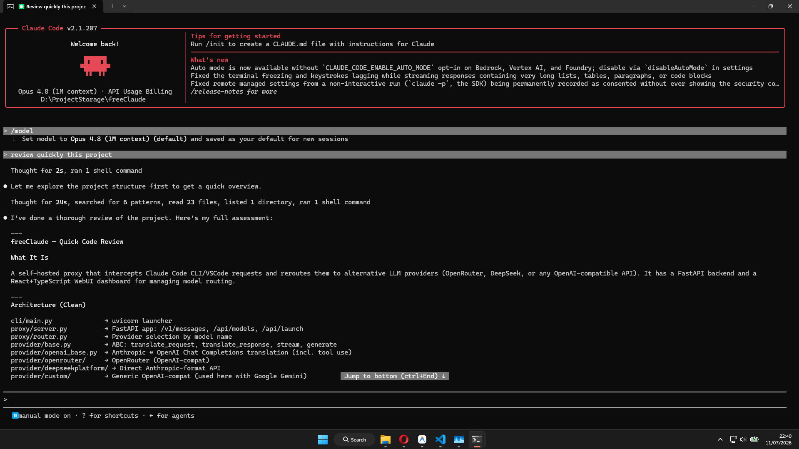
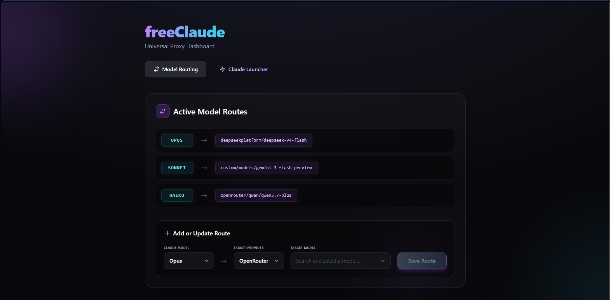

<div align="center">
  

  <h1>freeClaude</h1>
  <h3><strong>Unlock Claude Code — Free & Flexible</strong></h3>

  <p>
    
    
    
    
    
    
    
    
  </p>

  <p>An intelligent proxy server that re-routes Claude Code CLI and VS Code extension traffic to alternative LLM providers like OpenRouter and DeepSeek. Auto-detect installed IDEs, auto-configure settings, and launch with one click.</p>

  <p>
    <a href="#features">Features</a> •
    <a href="#quick-start">Quick Start</a> •
    <a href="#usage">Usage</a> •
    <a href="#configuration">Configuration</a> •
    <a href="#development">Development</a> •
    <a href="#architecture">Architecture</a>
  </p>

  <br/>

  
  <br/>
  <i>WebUI Dashboard — Model routing, IDE detection, one-click launch</i>
  <br/><br/>
  
  <br/>
  <i>Claude Code CLI running through freeClaude proxy with a DeepSeek backend</i>
</div>

---

## Features

| Feature | Description |
| ------- | ----------- |
| **Multi-Provider Routing** | Routes Anthropic API calls to OpenRouter, DeepSeek, or any OpenAI-compatible provider. |
| **Full SSE Streaming** | Real-time token-by-token streaming with Anthropic ↔ OpenAI SSE event translation. |
| **IDE Auto-Detect & Launch** | Detects VS Code, VSCodium, and Cursor. Auto-configures `~/.claude/settings.json` and IDE `settings.json` (`disableLoginPrompt`). One-click launch from WebUI. |
| **Terminal Launch** | Opens a new terminal with `ANTHROPIC_BASE_URL` and `ANTHROPIC_API_KEY` pre-set. Supports gnome-terminal, konsole, xterm, alacritty, kitty, and more on Linux. |
| **Native Tool Calls** | Bi-directional tool/function call translation with `toolu_` ID prefixing, ensuring full Claude Code agent compatibility. |
| **Web UI Dashboard** | React + TailwindCSS dashboard for model mapping, provider selection, IDE detection, and one-click launching. |
| **Extensible** | `BaseProvider → OpenAIBaseProvider` inheritance. Add a new provider in ~20 lines. |
| **Cross-Platform** | Windows, Linux, and macOS. CI-tested on both Windows and Linux (GitHub Actions). |

---

## Quick Start

### Prerequisites

- **Python 3.11+** — `python --version`
- **Node.js 18+ & npm** — for the WebUI frontend
- **API Key** for at least one provider ([OpenRouter](https://openrouter.ai/keys) or [DeepSeek](https://platform.deepseek.com/api_keys))

> **IMPORTANT — If you plan to use the Claude Code extension in VS Code / VSCodium / Cursor:**
> You MUST first install the Claude Code CLI globally via your terminal. The VS Code extension bundles its own copy of the CLI, but it requires the native binary to be present on your system.
>
> ```bash
> npm install -g @anthropic-ai/claude-code
> ```
>
> Without the native CLI installed, the extension will fail to initialize even after auto-configuration. This is a hard requirement from Anthropic, not freeClaude.

### Installation

**1. Clone the repository**
```bash
git clone https://github.com/momadhuynh04/freeClaude.git
cd freeClaude
```

**2. Create and activate a Python virtual environment**
```bash
python -m venv venv

# Windows (Command Prompt / PowerShell)
venv\Scripts\activate

# Linux / macOS
source venv/bin/activate
```

**3. Install Python dependencies**
```bash
pip install -r requirements.txt
```

**4. Configure your API keys**

Copy the example config:
```bash
cp .env.example .env
```

Edit `.env` and add your API keys:
```env
OPENROUTER_API_KEY="sk-or-v1-..."
DEEPSEEK_API_KEY="sk-..."
```

**5. Build the WebUI**
```bash
cd webui
npm install
npm run build
cd ..
```

**6. Launch**

| Platform | Production | Development |
| -------- | ---------- | ----------- |
| Windows | `start.bat` | `dev.bat` |
| Linux / macOS | `./start.sh` | `./dev.sh` |

Or manually:
```bash
uvicorn proxy.server:app --host 127.0.0.1 --port 8082
```

Then open `http://127.0.0.1:8082` in your browser.

---

## Usage

### 1. Route Models

In the **Model Routing** tab:
- Select a Claude model tier (Opus / Sonnet / Haiku)
- Pick a provider (OpenRouter or DeepSeek)
- Choose a target model from the live list
- Click **Save Route**

All mappings are persisted to `config.json` and editable live.

### 2. Launch Claude Code

In the **Launcher** tab, you can choose between:

| Launch Target | Description |
| ------------- | ----------- |
| **Terminal** | Opens a new terminal window with `ANTHROPIC_BASE_URL` and `ANTHROPIC_API_KEY` pre-configured. Supports local directories and git clone. |
| **VS Code / VSCodium / Cursor** | Auto-detected from your system. One click: sets up `~/.claude/settings.json`, configures the IDE's `disableLoginPrompt`, and opens the IDE in your project folder. |

For IDE launches, the Claude Code extension picks up the proxy settings automatically from `~/.claude/settings.json` — no manual configuration needed.

### 3. Use in Claude Code

Once launched, just use Claude Code normally. For CLI:
```bash
claude
```

For the extension: click the Spark icon in your IDE's toolbar. All traffic routes through `http://127.0.0.1:8082` transparently.

---

## Configuration

### Environment Variables (`.env`)

| Variable | Required | Description |
| -------- | -------- | ----------- |
| `OPENROUTER_API_KEY` | If using OpenRouter | Your OpenRouter API key |
| `DEEPSEEK_API_KEY` | If using DeepSeek | Your DeepSeek Platform API key |
| `DEEPSEEK_BASE_URL_ANTHROPIC` | No | DeepSeek Anthropic-compatible endpoint (default: `https://api.deepseek.com/anthropic`) |
| `DEEPSEEK_BASE_URL_OPENAI` | No | DeepSeek OpenAI-compatible endpoint (default: `https://api.deepseek.com`) |
| `PORT` | No | Server port (default: `8082`) |
| `HOST` | No | Server host (default: `127.0.0.1`) |
| `WORKSPACE` | No | Agent workspace directory (default: `./.agent-workspace`) |

### Model Mapping (`config.json`)

Managed through the WebUI. Format:
```json
{
  "model_mappings": {
    "opus": "deepseekplatform/deepseek-v4-pro",
    "sonnet": "openrouter/anthropic/claude-sonnet-4.5",
    "haiku": "deepseekplatform/deepseek-v4-flash"
  }
}
```

### Auto-Configuration Files

When you launch an IDE from the WebUI, freeClaude automatically writes:

| File | What it sets | Why |
| ---- | ------------ | --- |
| `~/.claude/settings.json` | `env.ANTHROPIC_BASE_URL` + `env.ANTHROPIC_API_KEY` | Routes extension traffic to proxy |
| `~/.config/<IDE>/User/settings.json` | `claudeCode.disableLoginPrompt: true` | Skips the OAuth login screen |

All existing settings are preserved — only these specific keys are added.

---

## Development

### Dev Environment

```bash
# Windows
dev.bat

# Linux / macOS
./dev.sh
```

```
Backend API   → http://127.0.0.1:8082  (uvicorn with auto-reload)
Frontend UI   → http://localhost:5173   (Vite HMR)
```

### Running Tests

```bash
# Activate venv first
# Windows:  venv\Scripts\activate
# Linux:    source venv/bin/activate

# Run all 66 tests
python -m pytest test/ -v

# Run a specific file
python -m pytest test/test_ide.py -v
```

### Test Coverage

| Test File | Tests | Covers |
| --------- | ----- | ------ |
| `test_ide.py` | 37 | IDE detection, setup, launch, count_tokens, browse-folder, safe merge, settings paths |
| `test_server.py` | 4 | Health endpoint, chat generation, error handling, tool call sessions |
| `test_models.py` | 4 | Pydantic model parsing — valid, missing fields, complex content |
| `test_openai_base.py` | 8 | Core translation — Anthropic↔OpenAI content, tool_use, generate() |
| `test_openai_stream.py` | 2 | Streaming SSE lifecycle for text and tool calls |
| `test_events.py` | 3 | SSE event formatting |
| `test_config.py` | 5 | ModelMapper — load/save, exact/keyword resolve, error cases |
| `test_openrouter.py` | 1 | OpenRouter adapter translation |
| `test_deepseek.py` | 1 | DeepSeek adapter passthrough |

**Total: 66 tests across 9 files.** CI runs on both Windows and Linux via GitHub Actions.

### Adding a New Provider

See [`provider/CUSTOM_PROVIDER_GUIDE.md`](provider/CUSTOM_PROVIDER_GUIDE.md). Quick version:

1. Create `provider/your_provider/adapter.py`
2. Extend `OpenAIBaseProvider` (OpenAI-compatible) or `BaseProvider`
3. Register in `proxy/router.py`
4. Minimal implementation (~10 lines):
```python
from provider.openai_base import OpenAIBaseProvider

class MyProvider(OpenAIBaseProvider):
    def __init__(self, target_model: str):
        super().__init__(
            target_model=target_model,
            base_url="https://api.myprovider.com/v1",
            api_key="your-key"
        )
```

---

## Architecture

### Request Flow

```
Claude Code (CLI or Extension)
       │  POST /v1/messages (Anthropic format)
       ▼
freeClaude Proxy (FastAPI :8082)
       │
       ├── ModelMapper: resolve model → (provider, target_model)
       │
       ├── ProviderRouter: instantiate adapter
       │
       ▼
Provider Adapter (OpenRouter / DeepSeek)
       │  Translate + stream
       ▼
LLM API (OpenRouter / DeepSeek)
       │  Response / SSE stream
       ▼
Translated back to Anthropic format → Claude Code
```

### Key Design Decisions

| Decision | Rationale |
| -------- | --------- |
| **DeepSeek uses Anthropic beta endpoint** | Native `/anthropic/v1/messages` passthrough — no translation needed. |
| **OpenRouter uses OpenAI translation** | Full Anthropic → OpenAI → Anthropic round-trip with tool calls and streaming. |
| **`toolu_` prefix management** | Stripped when sending to OpenAI, re-added when translating responses back. |
| **IDE auto-config** | Safe JSON merge — never overwrites user settings, only adds proxy keys. |

---

## Project Structure

```
freeClaude/
│
├── .github/workflows/ci.yml         # CI: Windows + Linux, 66 tests
│
├── proxy/                           # Core proxy server
│   ├── server.py                    # FastAPI app + all endpoints
│   └── router.py                    # ProviderRouter
│
├── provider/                        # LLM provider adapters
│   ├── base.py                      # Abstract BaseProvider
│   ├── openai_base.py               # Anthropic↔OpenAI translation
│   ├── openrouter/adapter.py        # OpenRouter adapter
│   ├── deepseekplatform/adapter.py  # DeepSeek adapter (passthrough)
│   └── CUSTOM_PROVIDER_GUIDE.md     # Add your own provider
│
├── models/                          # Pydantic data models
│   ├── anthropic.py                 # AnthropicRequest, AnthropicResponse
│   ├── events.py                    # SSEEvent
│   └── openai_compat.py             # OpenAI compatibility types
│
├── config/                          # Configuration
│   ├── settings.py                  # .env loader (pydantic-settings)
│   └── model_map.py                 # ModelMapper + config.json I/O
│
├── test/                            # 66 test cases (pytest)
│   ├── test_ide.py                  # IDE detection, launch, setup
│   ├── test_server.py               # Server integration
│   ├── test_models.py               # Pydantic parsing
│   ├── test_openai_base.py          # Core translation
│   ├── test_openai_stream.py        # SSE streaming
│   ├── test_events.py               # Event formatting
│   ├── test_config.py               # Model mapper
│   ├── test_openrouter.py           # OpenRouter adapter
│   └── test_deepseek.py             # DeepSeek adapter
│
├── webui/                           # React + TailwindCSS
│   └── src/
│       ├── App.tsx                  # Dashboard — routing + launcher
│       ├── App.css
│       └── main.tsx
│
├── cli/main.py                      # Entry point — uvicorn launcher
│
├── .env.example                     # Env config template
├── config.json                      # Model + IDE detection cache
├── requirements.txt                 # Pinned Python dependencies
├── start.bat / start.sh             # Production launcher
└── dev.bat / dev.sh                 # Development launcher
```

---

## License

MIT License — see [LICENSE](LICENSE).

Copyright © 2026 [huynhhoang04](https://github.com/momadhuynh04)
